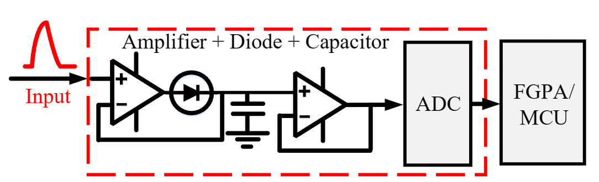
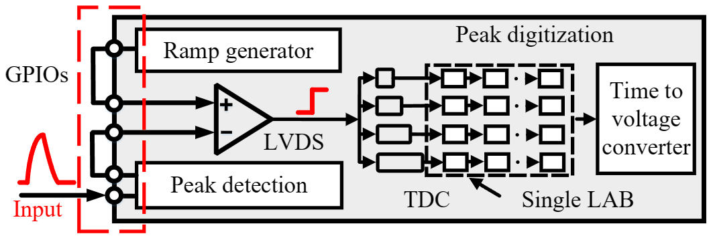
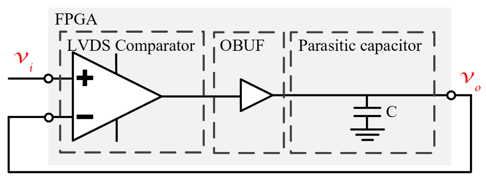
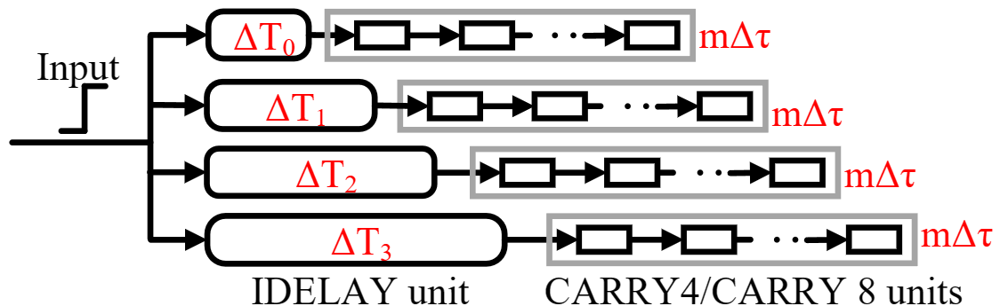
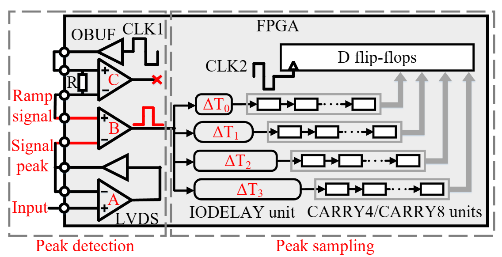
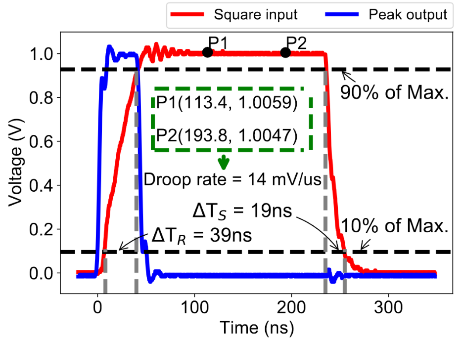
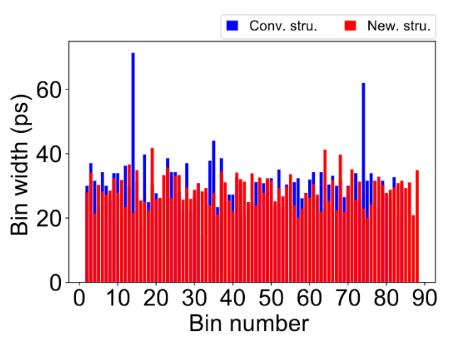
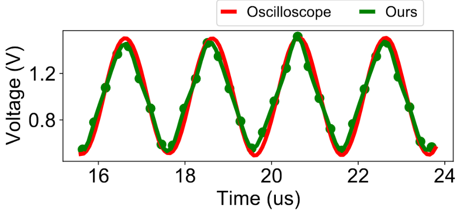
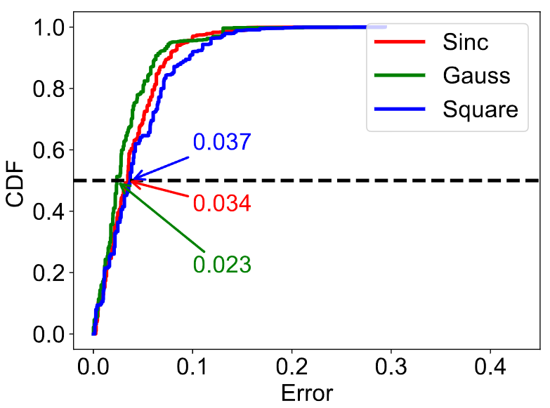

# digtal_sampling_analog
# FPGA for analog peak sampling
We use digital resources on FPGA to sample analog signal characteristics

Peak detection is useful in a wide range of applications. To achieve this task, conventional approaches (including dedicated ASIC-based designs) often demand analog readout chains and compulsory add-ons (e.g., additional ADC for peak sampling), rendering them neither compact nor flexible. we propose an FPGA-only solution to fulfill this task without any external components. Specifically, we achieve peak detection with only an LVDS comparator and two GPIOs. Therefore, one can flexibly make a practical deployment by a simple routing process, a non-trivial task even for inexperienced engineers. Meanwhile, to further compact the design for peak sampling, we leverage an FPGA-based slope ADC within which, we propose a new resource-efficient and calibration-free TDC architecture. The underlying rational is to minimize the nonlinearity problem by squeezing all resources within a single LAB. We have implemented a prototype using Xilinx FPGA and extensively evaluated its performance in rather challenging scenarios. Results demonstrate a peak digitization error of only about 30mV in a full 1.8V range for impulses with as few as 10ns pulse width. Meanwhile, in a practical deployment that requires a wide range of peak sampling, the achieved energy resolution is only 1.3% worse than a dedicated high-speed oscilloscope.

Conventional approach:
 

Our approach:
 

We have two contributions in our proposal:
(1) Peak detection using digital chains
(2) New TDC architecture for a Ramp ADC to sample analog peaks

The basic principle for peak detection can be illustrated in this figure:
 

The newly proposed tdc architecture can be found in this figure:
 

A more detailed overall schematic is:
 

# Detection performance

Results for square inputs:
 

For TDC in a code density test:
 

Ramp ADC sampling performance:
 

Closer look at peak detection:
 

Detection in challenging case:
 

# The attached code

The code is implemented using verilog HDL. It is compiled with Xilinx Vivado 2019.1. The hardware we used is Xilinx ZCU104, which is equipped with a 16nm Xilinx Zynq UltraScale+ **XCZU7EV-2FFVC1156** MPSoC. We use the IO from FMC to implement a system prototype. You can build and test it yourself. If you got any questions, please contact us. 

